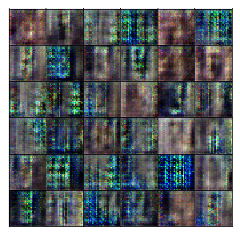
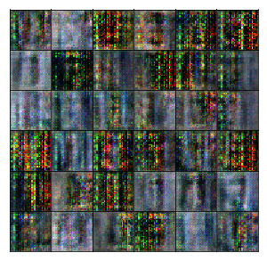
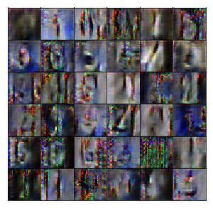
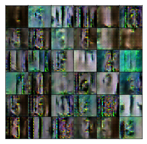

# Semi-Supervised Learning with Generative Adversarial Networks in Tensorflow

Tensorflow implementation of Semi-Supervised Learning with Generative Adversarial Networks 

## Prerequisities

- python
- tensorflow
- numpy
- scipy
- sklearn
- matplot
- pandas

## Results
Accuracy

Generator samples in 10 epoch

Generator samples in 20 epoch

Generator samples in 30 epoch

Generator samples in 40 epoch

## Related works

- [Udacity semi-supervised learning](https://github.com/udacity/deep-learning/tree/master/semi-supervised)
- [Semi-Supervised Learning with Generative Adversarial Networks](https://arxiv.org/abs/1606.01583)
- [Improved Techniques for Training GANs](https://arxiv.org/abs/1606.03498)

## Unfinished part
- Train the discriminator without changing the 1,000 label data
- Improve the performance of the model
